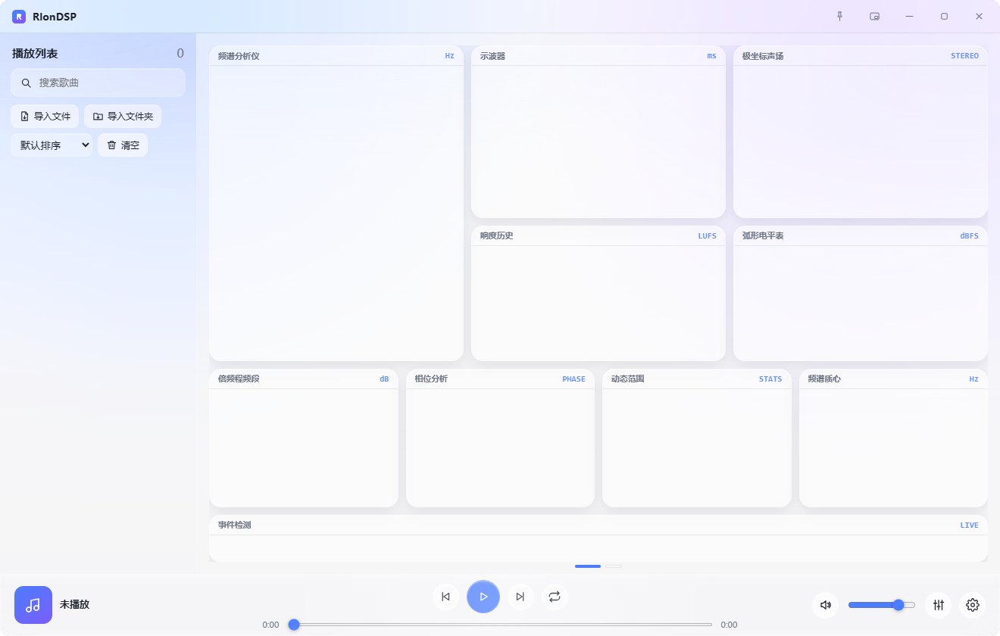
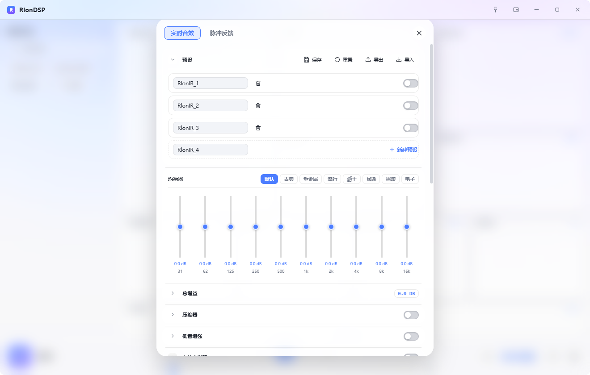
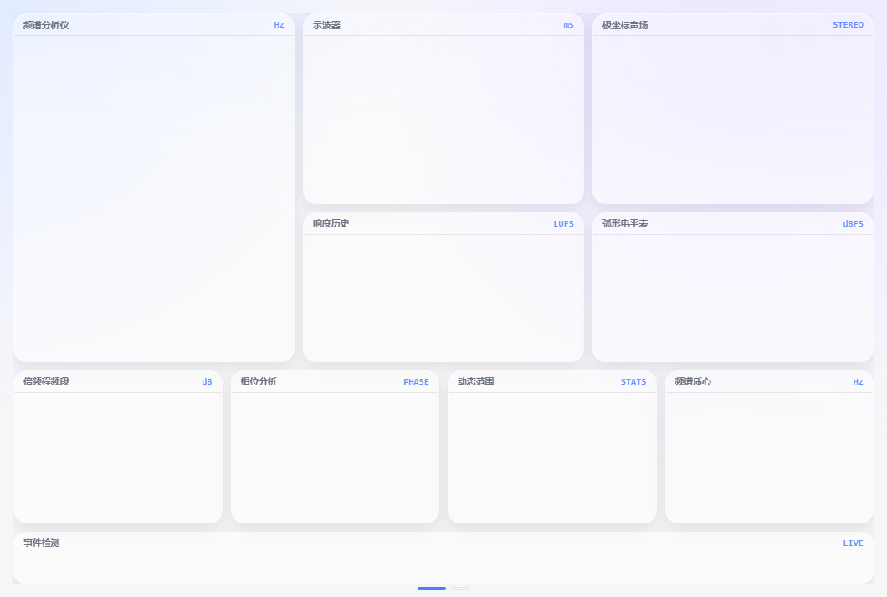
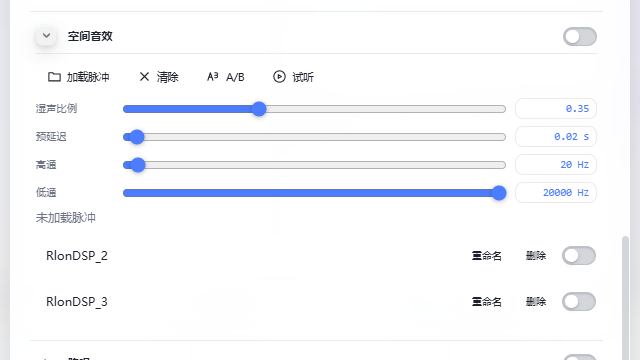
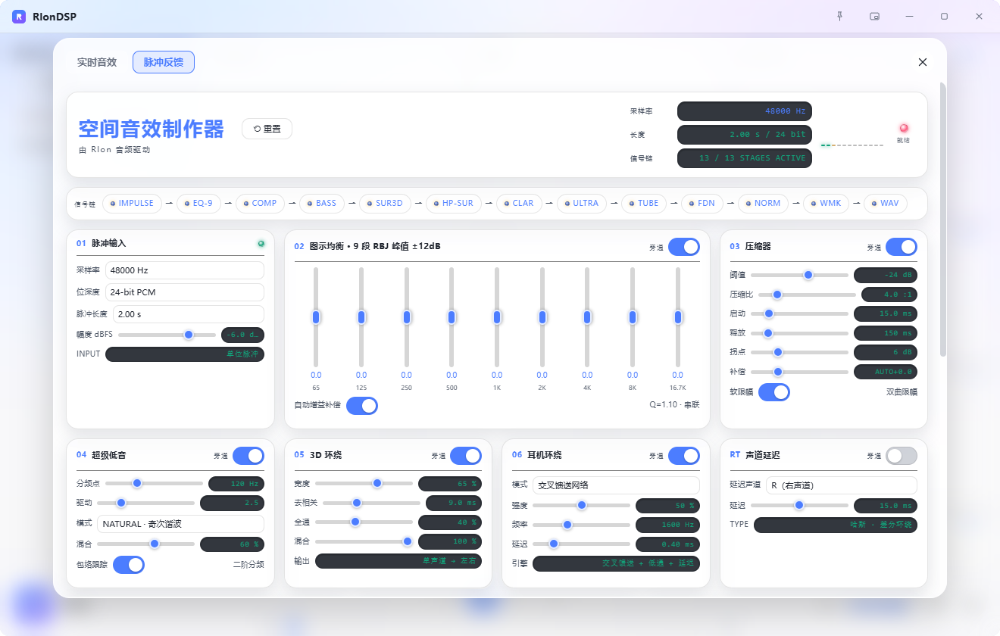
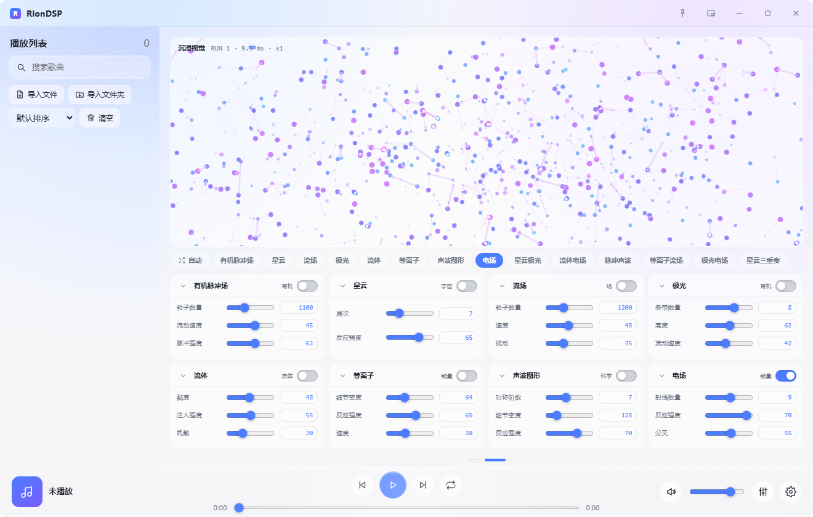
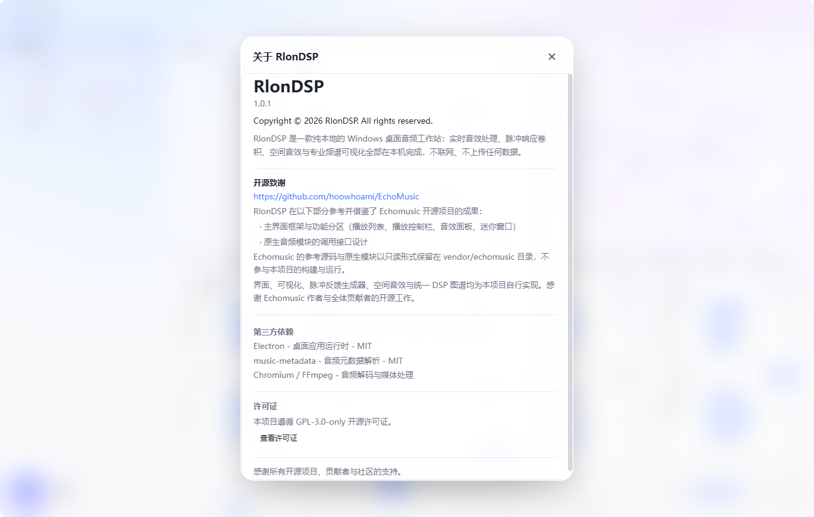

<div align="center">


# RlonDSP

**纯本地的 Windows 桌面音频工作站与音频实验平台**

实时音效处理 · 脉冲响应卷积 · 空间音效 · 专业频谱分析 · 音频反应可视化

[](LICENSE)
[](#-系统要求)
[](CHANGELOG.md)
[](https://www.electronjs.org/)
[](https://developer.mozilla.org/zh-CN/docs/Web/API/Web_Audio_API)

[项目简介](#-项目简介) · [核心能力](#-核心能力) · [界面展示](#-界面展示) · [架构](#-架构) · [快速开始](#-快速开始) · [路线图](#-路线图) · [贡献](#-贡献) · [许可证](#-许可证)

</div>

---

## 项目简介

RlonDSP 是一款纯本地的 Windows 桌面音频工作站：实时音效处理、脉冲响应卷积、空间音效与专业频谱可视化全部在本机完成，不联网、不上传任何数据。

它不是为了替代普通音乐播放器，而是把专业音频机架上的实时效果器、脉冲响应卷积，与一套电影级的实时音频可视化放进同一个窗口里。界面遵循 Apple Liquid Glass 设计语言，使用分层半透明材质、背景模糊、柔和阴影、大圆角与平滑缓动，控制层悬浮在内容层之上。

与普通播放器的区别在于：

- 所有效果器都进入统一的 DSP 图谱，而不是简单的“开关几个音效”；
- 空间音效与 IR 脉冲响应可实时加载、试听、A/B 对比；
- 内置 10 路专业音频分析器与独立的沉浸式视觉引擎；
- 项目以可扩展的 Provider 接口组织 DSP 来源，而不只是固定内置效果链。

## 核心能力

### 已实现

- **本地播放器**：导入文件 / 文件夹 / 拖拽导入，搜索、排序、清空，曲目时长与封面解析。
- **实时音效**：图示均衡器、压缩、低音增强、立体声增强、虚拟环绕、胆机模拟、混响、噪声门、前瞻限幅，以及动态 EQ、多段压缩、去齿音、扩展器、瞬态整形、削波 / 饱和、延迟 / 回声、合唱、镶边等。
- **统一 DSP 图谱**：内置 DSP、原生引擎、Provider 与空间音效都是同一张图中的独立节点；节点可启用 / 旁通 / 排序，延迟与尾音如实统计。
- **空间音效**：加载本地 WAV / AIFF 脉冲响应，实时卷积，支持干湿比、预延迟、高通、低通、A/B 对比与试听。
- **空间音效制作器（IR Studio）**：内嵌 13 级脉冲响应生成链，可生成并导出 16 / 24 / 32-bit WAV。
- **专业分析器**：频谱分析仪、示波器、极坐标声场、响度历史、弧形电平表、倍频程频段、相位分析、动态范围、频谱质心、事件检测。
- **沉浸式视觉引擎**：粒子场、密度场、向量场、程序化条带、流体、等离子、声波图形、电场等多种 Generator 与组合预设，支持自动轮换与音乐节拍驱动。
- **系统集成**：系统托盘、媒体键、全局快捷键、窗口置顶、迷你窗口模式、深浅主题与中英文实时切换。
- **版本更新**：应用内检查 GitHub Release、下载、SHA-256 校验，已安装版可自动升级；便携版提供发布页入口。

### 当前正在完善

- 更多第三方 Provider 的接入与隔离体验；
- 外部插件生态的成熟化；
- 可视化预设与音频参数的更细粒度控制。

### 未来规划

下面这些只在路线图中，不代表当前已经实现：

- 更完整的插件 / Provider 管理界面；
- Web 版或跨平台实验版本；
- 更深入的音频分析与可导出报告。

## 界面展示

以下截图均来自当前最新版 RlonDSP 的实际运行界面。

### 主工作区



展示主播放器、左侧播放列表、中部 10 路专业分析器与底部通栏播放控制栏。这是 RlonDSP 打开后的默认产品视图。

### DSP 工作区



展示实时音效面板中的统一 DSP 环境。多个效果器以卡片形式组织，可启用、旁通、折叠并实时调整参数。

### 分析器



展示 10 路实时音频分析器，全部由 `requestAnimationFrame` 驱动，播放时持续刷新，暂停时保留最后一帧。

### 空间音效



展示实时脉冲响应卷积的控制区：加载脉冲、清除、A/B、试听，以及干湿比、预延迟、高通、低通等参数。

### IR Studio / 脉冲反馈



展示空间音效制作器，用于生成、预览与管理脉冲响应 WAV 文件。

### 沉浸式视觉引擎



展示第二页的音频反应视觉引擎。当前版本提供多种 Generator 与组合预设，并支持自动轮换。

### 设置


展示主题、语言、输出设备与版本更新入口。

### 关于 RlonDSP



展示软件内「设置 → 关于 RlonDSP」页面，也是本仓库项目身份与核心文案的来源。

## 架构

```text
UI
 │
 ├── Renderer（播放器、列表、音效面板、设置、关于）
 │
 ├── DSP Host / Worklet
 │    ├── 统一 DSP 图谱
 │    ├── 内置 DSP 节点
 │    ├── Native / Provider 实现
 │    ├── 延迟 / 尾音 / 旁通 / 排序
 │    └── AudioWorklet 实时处理
 │
 ├── Analyzer
 │    └── 10 路专业音频可视化
 │
 ├── Visual Engine
 │    └── 粒子、流体、等离子、电场等音频反应生成器
 │
 ├── Spatial Audio
 │    └── IR 加载与实时卷积
 │
 └── IR / Convolution
      └── IR Studio、WAV 导出
```

源码运行在 Electron 桌面运行时中。渲染进程使用原生 HTML5、CSS3 与 JavaScript；音频处理运行在独立 `AudioWorklet` 线程中；DSP 图谱由 `src/dsp-host.js` 统一管理，第三方能力通过 Provider 接口接入。

## 技术栈

| 层 | 技术 | 说明 |
| :--- | :--- | :--- |
| 桌面运行时 | Electron 43.6.0 / Chromium 150 | 窗口、托盘、媒体键、全局快捷键 |
| 界面 | 原生 HTML5 + CSS3 + JavaScript | 无前端框架，无构建步骤 |
| 音频引擎 | Web Audio API + AudioWorklet | 实时 DSP 链与参数平滑 |
| 可视化 | Canvas 2D + `requestAnimationFrame` | 10 路分析器与沉浸式视觉引擎 |
| 元数据 | music-metadata | 本地音频标签、封面、时长解析 |
| 打包 | 7-Zip SFX + 项目配方 | 便携 zip 与安装包 exe |

## 系统要求

| 项目 | 要求 |
| :--- | :--- |
| 操作系统 | Windows 10 / 11（64 位） |
| 处理器 | x64 |
| 内存 | 建议 4 GB 及以上 |
| 磁盘 | 约 350 MB 可用空间（便携版解压后） |
| 音频 | 任意 Windows 可识别的输出设备 |
| 网络 | 不需要，程序全程离线运行 |

## 快速开始

### 直接使用发布包

前往 [Releases](https://github.com/EzRlon/RlonDSP/releases) 下载：

| 版本 | 文件名 | 说明 |
| :--- | :--- | :--- |
| 便携版 | `RlonDSP-1.0.1-portable-x64.zip` | 解压后双击 `RlonDSP.exe`，免安装 |
| 安装版 | `RlonDSP-1.0.1-setup-x64.exe` | 可选安装目录，创建桌面与开始菜单快捷方式 |

### 源码开发

要求：Node.js 18+ 与 npm；仅开发、测试和打包需要，运行发布包不需要。

```bash
git clone https://github.com/EzRlon/RlonDSP.git
cd RlonDSP
npm install
npm start
```

发布打包以 `tools/installer/README.md` 中的 7-Zip SFX 配方为准，不依赖 electron-builder 的 NSIS 流程。

## 项目结构

```text
src/                          # 渲染进程源码
  ├── index.html              # 主界面结构
  ├── renderer.js             # 播放器、列表、音效、可视化、i18n
  ├── dsp-host.js             # 统一 DSP 图谱与 Provider 接口
  ├── dsp-worklet.js          # AudioWorklet 实时 DSP
  ├── visual-engine.js        # 音频反应可视化引擎
  ├── ir-studio.html          # 空间音效制作器
  ├── ir-generator.js         # 脉冲响应生成与 WAV 导出
  └── styles / glass-*.css    # 布局与 Liquid Glass 视觉体系
assets/                       # 应用图标与托盘图标
docs/                         # 文档、架构说明、真实截图
tools/                        # 开发、测试、打包辅助脚本
vendor/echomusic/             # 上游参考源码与原生模块（只读，不参与构建运行）
release/                      # 本地打包产物（不入版本库）
```

## 路线图

### 已完成

- [x] 本地音乐播放与播放列表
- [x] 10 路专业音频分析器
- [x] 实时音效与统一 DSP 图谱
- [x] 空间音效与 IR 脉冲响应
- [x] IR Studio / 脉冲响应生成与 WAV 导出
- [x] 沉浸式音频反应视觉引擎
- [x] 主题、语言、托盘、媒体键与更新系统
- [x] v1.0.0 与 v1.0.1 正式 Release

### 进行中

- [ ] Provider / 第三方 DSP 接入体验
- [ ] 视觉预设与音频参数的更细粒度控制

### 计划

- [ ] 更完整的插件 / Provider 管理界面
- [ ] Web 版或跨平台实验版本
- [ ] 更深入的音频分析与可导出报告

## 贡献

欢迎通过 GitHub Issue 和 Pull Request 参与：

1. Fork 本仓库；
2. 创建功能分支；
3. 安装依赖并运行项目；
4. 修改代码并运行测试；
5. 提交并创建 Pull Request。

Bug Report 与 Feature Request 请在 [Issues](https://github.com/EzRlon/RlonDSP/issues) 提交。更完整的约定见 [CONTRIBUTING.md](CONTRIBUTING.md)。

## 许可证

本仓库根目录的 [LICENSE](LICENSE) 为 GPL-3.0-only。

## 上游致谢

RlonDSP 在以下部分参考并借鉴了 [Echomusic](https://github.com/hoowhoami/EchoMusic) 开源项目：

- 主界面框架与功能分区（播放列表、播放控制栏、音效面板、迷你窗口）
- 原生音频模块的调用接口设计

Echomusic 的参考源码与原生模块以只读形式保留在 `vendor/echomusic`，不参与本项目的构建与运行。界面、可视化、脉冲反馈生成器、空间音效与统一 DSP 图谱均为本项目自行实现。

感谢 Echomusic 作者、全体贡献者与所有开源项目的支持。
