<div align="center">


# RlonDSP

**融合 Apple Liquid Glass 设计语言的专业级桌面音频工作站**

本地播放 · 实时音效 · 脉冲反馈 · 专业频谱分析

[](LICENSE)
[](#-系统要求)
[](CHANGELOG.md)
[](https://www.electronjs.org/)
[](https://developer.mozilla.org/zh-CN/docs/Web/API/Web_Audio_API)
[](#-核心特性)

[核心特性](#-核心特性) · [音效系统](#-音质与音效) · [频谱可视化](#-可视化与频谱分析) · [下载安装](#-下载与安装) · [路线图](#-路线图) · [鸣谢](#-开源引用与鸣谢)

</div>

---

## 📖 这是什么

RlonDSP 是一款**纯本地**的 Windows 桌面音频工作站与播放器。它把专业音频机架上的实时效果器、脉冲响应卷积，与一套电影级的实时频谱可视化放进了同一个界面里，并且全部处理都在这台电脑上完成——不联网、不上传、不采集任何音频数据。

界面遵循 Apple **Liquid Glass（动态玻璃）** 设计语言：分层半透明材质、背景模糊、柔和阴影、大圆角、平滑缓动，控制层悬浮于内容层之上。

> 本项目基于开源项目 [Echomusic](https://github.com/hoowhoami/EchoMusic) 分支改造与扩展，完整保留上游版权与许可证信息，详见 [NOTICE](NOTICE) 与 [ACKNOWLEDGEMENTS.md](ACKNOWLEDGEMENTS.md)。

## 🖼 界面预览

<div align="center">

### 主界面

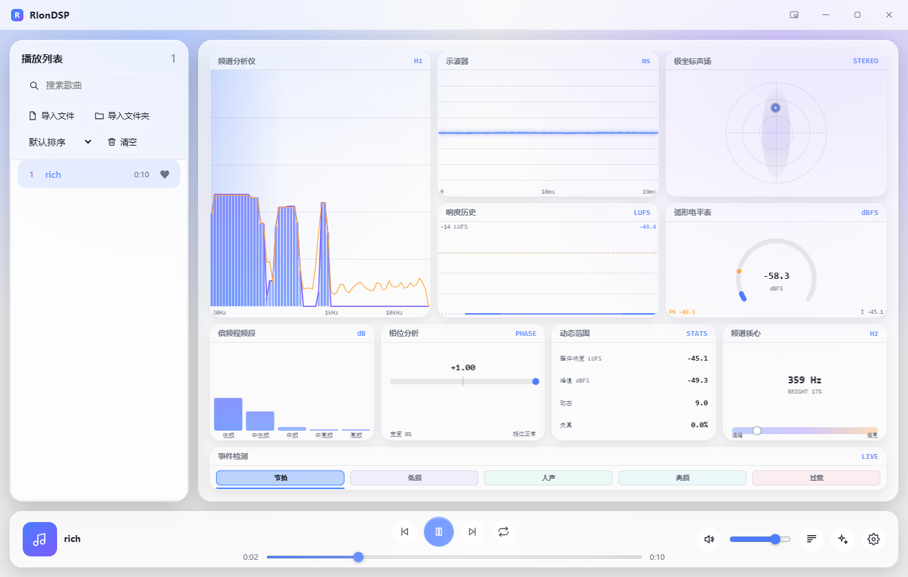

<sub>左侧播放列表 · 中部十联可视化 · 底部悬浮播放控制栏 · 顶部 Liquid Glass 标题栏</sub>

</div>

### 可视化总览

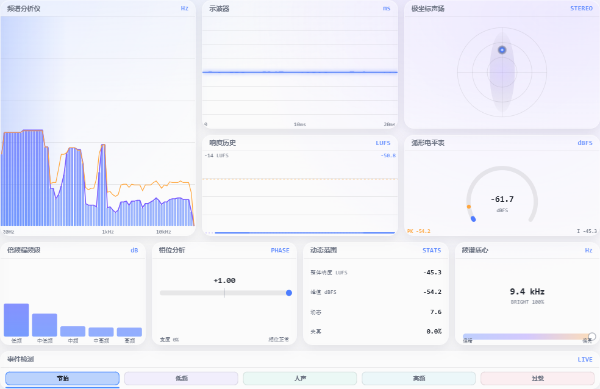

### 实时音效 / 脉冲反馈 / 桌面歌词 / 设置 / 迷你模式

| 实时音效 | 脉冲反馈（DSP-IR 1200） |
| :---: | :---: |
| 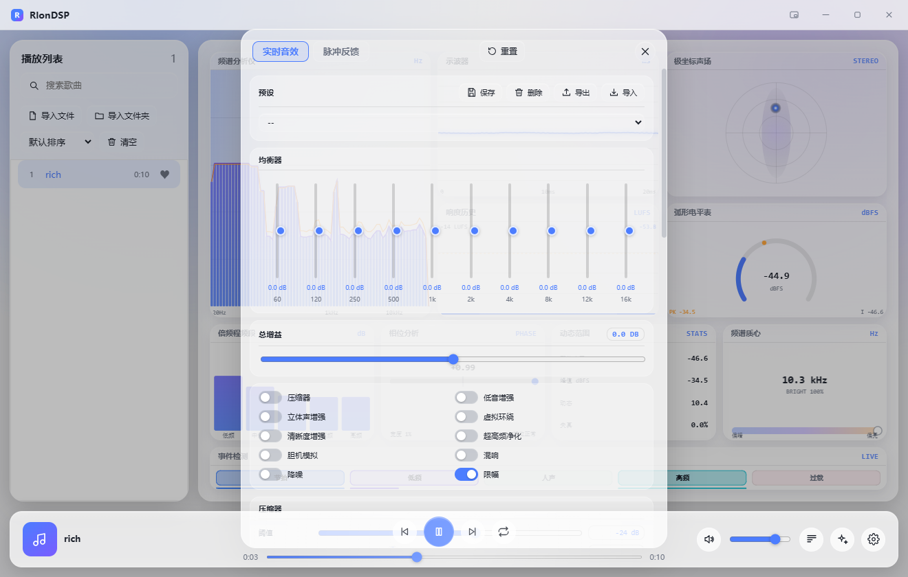 | 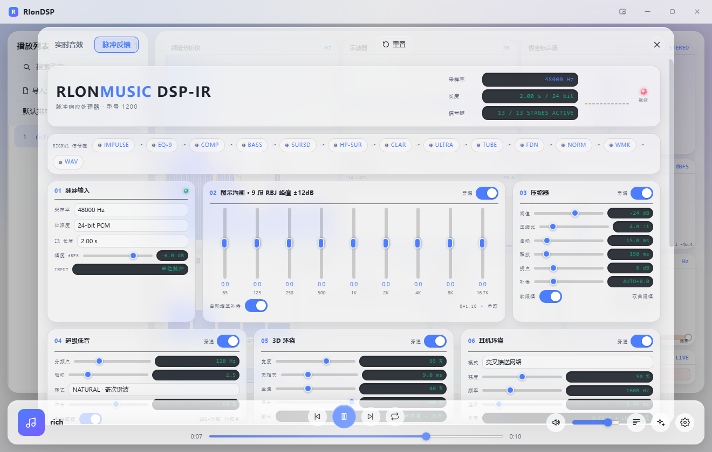 |

| IRS 空间音效 | 设置 |
| :---: | :---: |
| 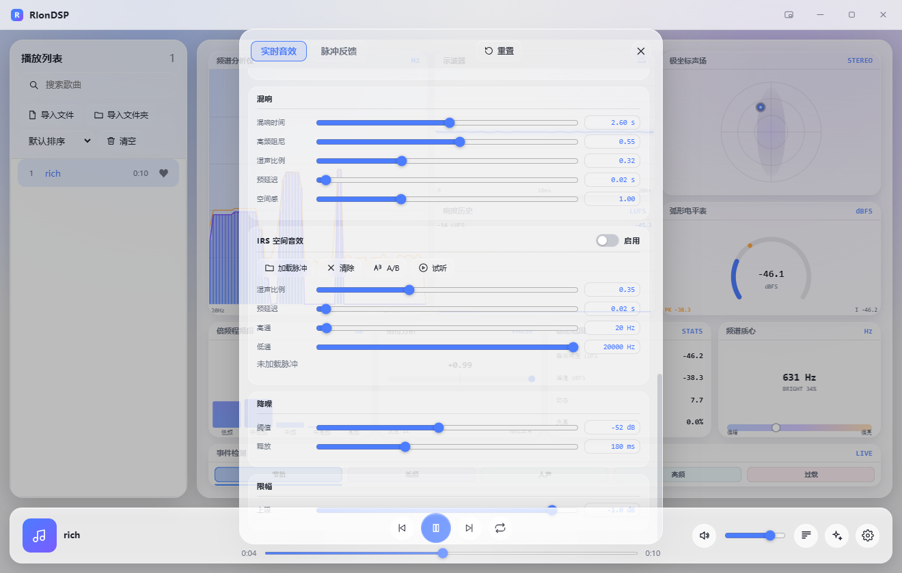 | 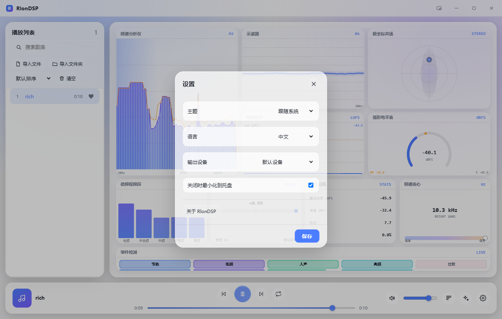 |

| 桌面歌词 | 迷你模式 |
| :---: | :---: |
|  |  |

## ✨ 核心特性

- **极致美学：Liquid Glass 动态毛玻璃** — 全局统一的设计令牌（`glass-theme.css`），分层玻璃材质：全局背景层 / 面板层 / 内容层 / 控制层 / 微玻璃。播放控制栏带**跟随鼠标的动态高光**与玻璃边缘折射感，并完整支持*减弱透明*、*减弱动态*、*不支持背景模糊* 三种降级。
- **实时频谱分析：10 个专业可视化模块** — 频谱分析仪、示波器、极坐标声场、响度历史、弧形电平表、倍频程频段、相位分析、动态范围、频谱质心、事件检测，一屏铺满、互不重复，全部由 `requestAnimationFrame` 驱动，暂停即停笔、画面保留最后一帧。
- **脉冲反馈生成器：13 级 DSP 链** — 内嵌 RLONMUSIC DSP-IR 1200 脉冲响应生成器，信号链为 `IMPULSE → EQ-9 → COMP → BASS → SUR3D → HP-SUR → CLARITY → ULTRA → TUBE → FDN → NORM → WMK → WAV`，可导出 16 / 24 / 32-bit WAV。
- **9 段图示均衡器** — 每段 ±12 dB，覆盖 65 Hz ~ 16 kHz，配合总增益（-120 ~ +120 dB）与实时参数反馈。
- **IRS 空间音效** — 加载本地 WAV / AIFF 脉冲响应文件，实时卷积，支持干湿比、预延迟、高通、低通、A/B 对比、试听与旁路。
- **逐字歌词** — 读取同名 `.lrc` 文件并逐行同步，支持独立的**桌面歌词窗口**（无边框、半透明、置顶、可拖动）。
- **播放列表管理** — 导入文件 / 文件夹 / 拖拽导入，搜索、排序、清空，曲目时长与封面解析。
- **系统集成** — 系统托盘、媒体键（播放/暂停、上一曲、下一曲）、`Ctrl+Alt+P / ← / →` 全局快捷键、关闭时最小化到托盘、迷你窗口模式（360 × 64）。
- **多语言** — 界面文字全部走语言表，中文 / English 实时切换，包含画布内绘制的标注文字。

## 🎚 音质与音效

所有音频处理都在 **AudioWorklet** 中完成，运行于独立的音频渲染线程，不阻塞界面。

| 模块 | 关键参数 |
| :--- | :--- |
| 图示均衡器 | 9 段，每段 ±12 dB（65 / 125 / 250 / 500 / 1k / 2k / 4k / 8k / 16k Hz） |
| 总增益 | -120 ~ +120 dB |
| 压缩器 | 阈值 -60 ~ 0 dB、压缩比 1:1 ~ 12:1、启动 1 ~ 50 ms、释放 20 ~ 600 ms |
| 低音增强 | 增益 0 ~ +12 dB、分频点 40 / 60 / 80 / 120 Hz |
| 立体声增强 | 宽度 0 ~ 1.50 |
| 虚拟环绕 | 空间感 0 ~ 2.00 |
| 清晰度增强 | 强度 0 ~ 1.00 |
| 超高频净化 | 开关式 |
| 胆机模拟 | 驱动 0 ~ 1.00 |
| 混响（FDN） | 混响时间 0.10 ~ 5.00 s、高频阻尼、湿声比例、预延迟、房间大小 |
| 降噪（噪声门） | 阈值 -80 ~ -20 dB、释放 20 ~ 500 ms |
| 限幅 | 上限 -12 ~ 0 dB |
| IRS 空间音效 | 干湿比、预延迟、高通 10 ~ 500 Hz、低通 1 k ~ 20 kHz、A/B 对比 |
| 预设系统 | 保存 / 删除 / 导出 / 导入 |

## 📊 可视化与频谱分析

全部 10 个模块共用同一份每帧计算的音频度量（`computeVizMetrics`），因此不会重复解析音频数据、不产生额外开销。

| 面板 | 数据来源 | 说明 |
| :--- | :--- | :--- |
| 频谱分析仪 | `getByteFrequencyData()` | 对数频率刻度的柱状频谱 + 峰值保持线 |
| 示波器 | `getFloatTimeDomainData()` | 双声道时域波形，含时间刻度与触发稳定 |
| 极坐标声场 | 声道相关度 | 立体声像定位、声场宽度、移动光斑 |
| 响度历史 | RMS 累积 | LUFS 随时间变化曲线 + 参考线 |
| 弧形电平表 | 峰值 / RMS | 实时 dBFS、峰值与过载预警 |
| 倍频程频段 | 5 段能量统计 | 低频 / 中低频 / 中频 / 中高频 / 高频 |
| 相位分析 | 声道相关度 | 相关度数值、立体声宽度、正反相位指示 |
| 动态范围 | 统计值 | 整体 LUFS、峰值 dBFS、动态范围、失真度 |
| 频谱质心 | 频域加权重心 | 重心频率与音色明暗度 |
| 事件检测 | 频段能量突变 | Beat / Bass / Vocal / High Freq / Overload 事件灯带 |

<details>
<summary>展开查看各面板单独截图</summary>

| 频谱分析仪 | 示波器 | 极坐标声场 |
| :---: | :---: | :---: |
| 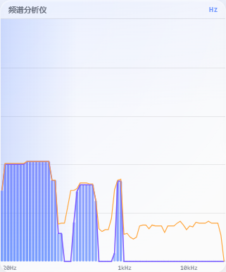 | 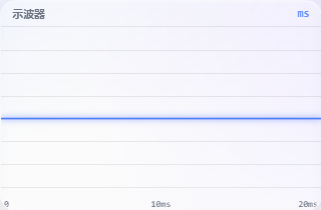 | 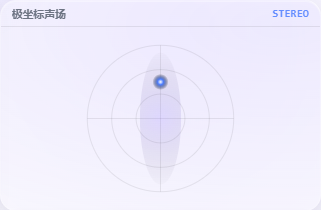 |

| 响度历史 | 弧形电平表 | 倍频程频段 |
| :---: | :---: | :---: |
| 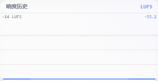 | 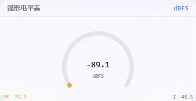 | 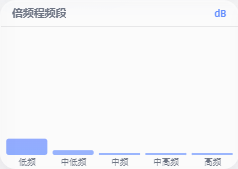 |

| 相位分析 | 动态范围 | 频谱质心 | 事件检测 |
| :---: | :---: | :---: | :---: |
| 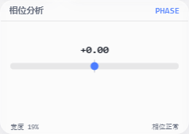 | 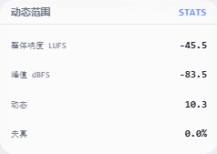 | 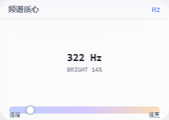 | 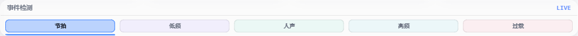 |

</details>

## 🧱 技术栈

> 以下为 RlonDSP **本项目实际使用** 的技术，均为实测确认。

| 层 | 技术 | 版本 | 用途 |
| :--- | :--- | :--- | :--- |
| 桌面运行时 | [Electron](https://www.electronjs.org/) | 43.6.0（Chromium 150） | 桌面外壳、窗口、托盘、全局快捷键 |
| 界面 | 原生 HTML5 + CSS3 + JavaScript（ES2020+） | — | 渲染进程界面与交互 |
| 音频引擎 | [Web Audio API](https://developer.mozilla.org/zh-CN/docs/Web/API/Web_Audio_API) + AudioWorklet | — | 实时 DSP 处理链、参数平滑 |
| 可视化 | Canvas 2D + `requestAnimationFrame` | — | 10 路实时音频可视化 |
| 元数据 | [music-metadata](https://github.com/Borewit/music-metadata) | ^11.0.0 | 本地音频标签、封面、时长解析 |
| 音效容器 | 浮层玻璃材质（自研 CSS 令牌系统） | 1.0.0 | Liquid Glass 视觉体系 |
| 打包 | [electron-builder](https://www.electron.build/) + 7-Zip | ^26.0.12 | 便携版 / 安装包 |

**界面与业务全部由原生 Web 技术实现**，没有引入前端框架与构建工具链，因此没有构建产物、没有编译步骤，源码即成品。

## 💻 系统要求

| 项目 | 要求 |
| :--- | :--- |
| 操作系统 | Windows 10 / 11（64 位） |
| 处理器 | x64 |
| 内存 | 建议 4 GB 及以上 |
| 磁盘 | 约 350 MB 可用空间（便携版解压后） |
| 音频 | 任意 Windows 可识别的输出设备（支持设备枚举与切换） |
| 网络 | **不需要**，程序全程离线运行 |

## 📦 下载与安装

前往 [Releases](https://github.com/EzRlon/RlonDSP/releases) 页面下载：

| 版本 | 文件名 | 说明 |
| :--- | :--- | :--- |
| 便携版 | `RlonDSP-1.0.0-portable-x64.zip` | 解压后双击 `RlonDSP.exe` 即可使用，**免安装** |
| 安装版 | `RlonDSP-1.0.0-setup-x64.exe` | 向导式安装，可选安装目录，自动创建桌面与开始菜单快捷方式 |

**零基础三步走：**

1. 下载并解压便携版压缩包；
2. 双击 `RlonDSP.exe`；
3. 点「导入文件」选择本地音乐，双击歌曲开始播放。

详细图文说明见程序目录内的 `使用说明.txt`。

## 🚀 快速开始（开发）

```bash
# 1. 获取源码
git clone https://github.com/EzRlon/RlonDSP.git
cd RlonDSP

# 2. 安装依赖（仅开发需要；运行成品不需要）
npm install

# 3. 启动调试
npm start

# 4. 打包
npm run dist:portable   # 便携版
npm run dist:nsis       # 安装包
```

> 本项目的界面代码是纯 Web 技术，**改完源码刷新窗口即可生效**，无需编译。打包产物的源码副本位于 `release/RlonDSP-portable/resources/app/`。

## 📁 项目结构

```text
RlonDSP/
├── main.js                  # Electron 主进程：窗口、托盘、菜单、IPC 注册、快捷键
├── preload.js               # 主窗口预加载桥接（contextBridge，仅暴露必要能力）
├── lyrics-preload.js        # 桌面歌词窗口预加载桥接
├── package.json             # 项目元信息与打包配置
├── src/
│   ├── index.html           # 主界面结构 + 内联 SVG 图标雪碧图
│   ├── renderer.js          # 渲染进程：播放器、列表、音效、可视化、歌词、i18n
│   ├── styles.css           # 基础样式与布局
│   ├── glass-theme.css      # Liquid Glass 设计令牌（--lg-* 命名空间）
│   ├── glass-components.css # 玻璃组件类（.lg-surface / .lg-player-bar 等）
│   ├── glass-motion.js      # 播放栏跟随鼠标的动态高光
│   ├── dsp-worklet.js       # AudioWorklet 实时 DSP 处理链
│   ├── ir-studio.html       # 脉冲反馈生成器（DSP-IR 1200）
│   ├── ir-generator.js      # 脉冲响应生成与 WAV 导出
│   └── lyrics.html/.css/.js # 桌面歌词窗口
├── assets/                  # 应用图标（ico / png / 托盘图标）
├── docs/                    # 文档与截图
│   ├── images/              # README 使用的界面与功能截图
│   ├── ARCHITECTURE.md      # 架构说明
│   ├── RELEASING.md         # 发布流程
│   ├── GITHUB.md            # GitHub 账户与仓库信息
│   └── GITHUB_WORKFLOW.md   # Git / GitHub 操作规范
├── tools/                   # 开发与打包辅助脚本
│   └── tests/smoke.test.js  # 冒烟测试（播放/暂停、切歌、音量、主题）
├── vendor/echomusic/        # 上游 Echomusic 参考源码与原生音频模块
├── release/                 # 打包产物（不入版本库）
├── ACKNOWLEDGEMENTS.md      # 开源引用与鸣谢
├── CONTRIBUTING.md          # 贡献指南
├── CHANGELOG.md             # 更新日志
├── NOTICE / NOTICE-RlonDSP  # 版权与分支说明
└── LICENSE                  # GPL-3.0-only
```

更详细的模块划分与数据流见 [docs/ARCHITECTURE.md](docs/ARCHITECTURE.md)。

## 🗺 路线图

### 已完成（v1.0.0）

- [x] Liquid Glass 设计令牌与玻璃组件体系
- [x] 无边框窗口、自定义标题栏、迷你窗口模式
- [x] 10 路专业音频可视化（每帧共享度量，暂停即停笔）
- [x] AudioWorklet 实时音效链（均衡、压缩、混响、降噪、限幅等）
- [x] 脉冲反馈生成器（13 级 DSP 链、WAV 导出、脉冲列表管理）
- [x] IRS 空间音效（本地 IR 加载、卷积、干湿比、A/B 对比）
- [x] 桌面歌词窗口与逐行同步
- [x] 中英双语（含画布内文字）
- [x] 系统托盘、媒体键与全局快捷键
- [x] 冒烟测试与便携版 / 安装包发布

### 规划中

- [ ] 播放列表与会话状态持久化（跨启动保留）
- [ ] 更多 EQ 形态（31 段图形均衡器）
- [ ] 脉冲反馈预设的导入 / 导出（`.wav` + 元数据打包）
- [ ] 可视化布局自定义（面板显示 / 隐藏与顺序调整）
- [ ] 频谱截图导出与分享
- [ ] 无障碍增强（完整键盘导航与屏幕阅读器标注）
- [ ] 自动更新通道

## 📜 开源引用与鸣谢

本项目站在这些优秀开源项目的肩膀上：

| 名称 | 许可证 | 用途 |
| :--- | :--- | :--- |
| [Echomusic](https://github.com/hoowhoami/EchoMusic) | GPL-3.0-only | 本项目分支来源，提供音频播放与音效框架 |
| [Electron](https://www.electronjs.org/) | MIT | 桌面应用运行时 |
| [Chromium](https://www.chromium.org/) / [FFmpeg](https://ffmpeg.org/) | BSD-3-Clause / LGPL-2.1+ | 媒体解码与渲染，随 Electron 分发 |
| [music-metadata](https://github.com/Borewit/music-metadata) | MIT | 本地音频元数据解析 |
| [electron-builder](https://www.electron.build/) | MIT | 安装包与便携版打包 |
| [dsp-ir-1200](https://github.com/EzRlon/dsp-ir-1200) | GPL-3.0 | 脉冲响应生成 DSP 链参考实现 |

完整的许可证清单、必需署名与感谢名单见 **[ACKNOWLEDGEMENTS.md](ACKNOWLEDGEMENTS.md)**。

特别感谢 **Apple Human Interface Guidelines** 中 Liquid Glass 材质的设计思想，为本项目的视觉体系提供了灵感。

## 🤝 贡献

欢迎提交 Issue 与 Pull Request。开始之前请阅读 [CONTRIBUTING.md](CONTRIBUTING.md) 了解分支规范、提交信息格式与自测要求。

## ⚖️ 许可证

本项目遵循 **GNU General Public License v3.0 only（GPL-3.0-only）**，与上游 Echomusic 的许可证保持一致。完整条款见 [LICENSE](LICENSE)。

由于上游 Echomusic 原生音频模块以 GPL-3.0-only 分发，本项目作为其衍生作品同样以 GPL-3.0-only 发布。

<div align="center">

**RlonDSP** · Copyright © 2026 RlonDSP

基于 [Echomusic](https://github.com/hoowhoami/EchoMusic) 开源项目分支改造与扩展

</div>
