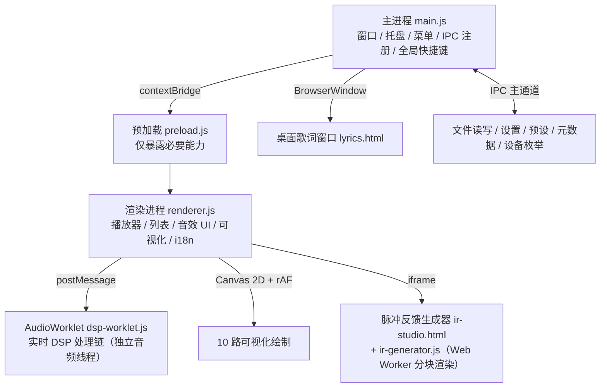
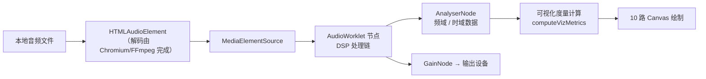
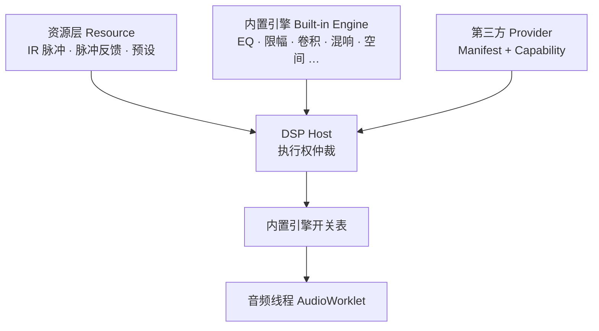

# RlonDSP 架构说明

本文说明 RlonDSP 的整体结构、进程分工与数据流，便于二次开发与问题定位。

---

## 一、进程与线程模型

RlonDSP 采用 Electron 标准的**多进程 + 多线程**结构，音频处理与界面渲染彼此隔离，互不阻塞。



| 层 | 运行位置 | 职责 | 关键文件 |
| :--- | :--- | :--- | :--- |
| 主进程 | 独立进程 | 窗口生命周期、托盘、菜单、文件对话框、设置与预设持久化、元数据读取、全局快捷键、输出设备枚举 | `main.js` |
| 预加载 | 主进程与渲染进程之间 | 通过 `contextBridge` 暴露受限 API，保持 `contextIsolation: true` | `preload.js`、`lyrics-preload.js` |
| 渲染进程 | 每个窗口一个 | 界面渲染、播放控制、音效参数绑定、可视化绘制、语言表 | `src/renderer.js`、`src/index.html` |
| 音频线程 | AudioWorklet 专用线程 | 实时 DSP：均衡、压缩、环绕、混响、降噪、限幅等 | `src/dsp-worklet.js` |
| 歌词窗口 | 独立窗口 | 无边框、半透明、置顶的桌面歌词 | `src/lyrics.html`、`src/lyrics.js` |
| 脉冲生成 | iframe + Web Worker | 13 级 DSP 链离线渲染并导出 WAV | `src/ir-studio.html`、`src/ir-generator.js` |

## 二、音频数据流



要点：

1. **解码**依赖 Chromium / FFmpeg 内置解码器，本项目未额外引入解码库，也未调用外部 FFmpeg 进程。
2. **DSP** 全部在 AudioWorklet 中执行，运行于独立音频线程，界面卡顿不会中断声音。
3. **可视化**共用同一个 `AnalyserNode`，每帧只解析一次音频数据，再分发给 10 个面板，避免重复计算。
4. **渲染循环**由 `requestAnimationFrame` 驱动。按下暂停时循环主动停止（`animationFrame = null`），画面保留最后一帧；恢复播放时立即重启循环。
5. **脉冲反馈**的卷积与离线渲染在脉冲生成器内部完成，生成结果通过消息传递回主界面，再装载到 IRS 空间音效模块。

## 三、视觉系统

RlonDSP 的 Liquid Glass 视觉体系由三层组成，全部通过 CSS 变量驱动：

| 文件 | 作用 |
| :--- | :--- |
| `src/glass-theme.css` | 设计令牌：`--lg-bg`、`--lg-border`、`--lg-blur`、`--lg-saturate`、`--lg-highlight`、`--lg-shadow`、`--lg-radius-*`、`--lg-duration`、`--lg-ease`、`--lg-fallback-bg` 等 |
| `src/glass-components.css` | 玻璃组件类：`.lg-surface` 及变体（`--control` / `--strong` / `--light` / `--micro` / `--panel` / `--content`），组件类 `.lg-navbar`、`.lg-sidebar`、`.lg-modal`、`.lg-menu`、`.lg-fab`、`.lg-player-bar`、`.lg-toast` |
| `src/glass-motion.js` | 播放控制栏的鼠标跟随高光，使用 `requestAnimationFrame` 节流并写入 CSS 变量 |

玻璃材质按**层级强弱**分级，而不是全屏统一糊化：

```text
全局背景层（最弱）→ 面板层 → 内容层（高不透明，保证文字可读）→ 控制层（最强，悬浮于最上）→ 微玻璃（按钮、下拉、提示）
```

降级策略：

| 条件 | 行为 |
| :--- | :--- |
| `@supports not (backdrop-filter: blur())` | 使用 `--lg-fallback-bg` 的实色半透明背景，并隐藏高光层 |
| `prefers-reduced-transparency` | 降低透明程度，提升背景不透明度 |
| `prefers-reduced-motion` | `--lg-motion` 置 0，关闭高光跟随与过渡动画 |

## 四、状态与持久化

渲染进程维护一个 `state` 对象（播放列表、当前曲目、播放状态、音量、设置快照）。持久化由主进程负责，统一落在 Electron 的 `userData` 目录：

| 数据 | 文件 | 说明 |
| :--- | :--- | :--- |
| 用户设置 | `settings.json` | 语言、主题、音量、输出设备、托盘行为、桌面歌词开关等 |
| 音效预设 | `presets.json` | 实时音效预设（含脉冲反馈预设 `pulse-*`） |
| 收藏 | `favorites.json` | 收藏列表 |
| 播放历史 | `history.json` | 最近播放记录 |

IPC 通道按域划分，命名形如 `域:动作`：

| 通道 | 用途 |
| :--- | :--- |
| `dialog:openFiles` / `dialog:openFolder` / `dialog:openIRFile` | 文件与文件夹选择对话框 |
| `fs:scanFolder` | 扫描文件夹内的音频文件 |
| `meta:read` | 读取单个音频文件的元数据 |
| `settings:get` / `settings:set` | 读取与合并写入用户设置 |
| `presets:list` / `presets:save` / `presets:delete` / `presets:export` / `presets:import` | 音效预设的增删改查与导入导出 |
| `favorites:get` / `favorites:set` | 收藏读写 |
| `history:get` / `history:add` | 播放历史 |
| `lyrics:read` | 读取同名 `.lrc` 歌词文件 |
| `lyrics:show` / `lyrics:hide` / `lyrics:update` | 桌面歌词窗口的显示、隐藏与内容推送 |
| `window:*` | 窗口最小化、最大化、关闭、迷你模式切换与状态通知 |
| `shortcut:*` | 全局快捷键触发的播放控制事件 |
| `app:open-license` | 打开本地许可证文件 |

## 五、DSP Host（资源 / 引擎 / Provider 三层分离）

为避免出现「两套 EQ 同时处理」「两个限幅器叠加」这类会直接破坏音质的问题，
项目引入 `src/dsp-host.js` 作为唯一的执行权仲裁者。



| 层 | 职责 | 是否进入音频线程 |
| :--- | :--- | :--- |
| 资源层 | 存放 IR、脉冲反馈、预设等数据 | 否 |
| 引擎层 | 真正执行算法（内置 13 类） | 是（内置实现） |
| Provider 层 | 第三方 DSP 扩展，声明自己接管哪些类型 | 由 Provider 自行决定 |
| DSP Host | 仲裁「某个类型由谁执行」，并生成内置引擎开关表 | 否 |

**硬约束：同一种类型在同一时刻只能有一个执行者。**

- 内置引擎默认拥有全部类型。
- Provider 声明某项能力后立即接管，被接管类型的内置实现被关闭。
- 两个 Provider 不能抢占同一种能力（后注册者被拒绝）。
- Provider 出错时自动停用、释放能力，内置实现立即恢复，音频不中断。

开关表的实际作用：`builtinMask()` 会被下发到 AudioWorklet，音频线程逐项检查
（`this.on('eq')` 等），为 `false` 时完全跳过该模块 —— 这就是「不重复处理」在实时路径上的落地。

内置的 13 类引擎：总增益、均衡器、低音增强、压缩器、清晰度增强、立体声增强、
空间音效、胆机模拟、超高频净化、混响、降噪、限幅、脉冲卷积。

## 六、性能设计

| 措施 | 说明 |
| :--- | :--- |
| 每帧只解析一次音频数据 | `computeVizMetrics()` 统一计算所有面板所需的度量值，10 个面板共享结果 |
| 预分配缓冲区 | `freqData` / `timeData` 等数组在初始化时一次性分配，绘制过程中不产生新数组 |
| 暂停即停笔 | 暂停时停止 `requestAnimationFrame` 循环，不空转、不清屏、不闪烁 |
| 不可见即暂停 | 窗口被隐藏或最小化时停止渲染循环，恢复可见且正在播放时自动重启 |
| 高光节流 | 鼠标移动的高光更新通过 `requestAnimationFrame` 合并，避免每个 `mousemove` 都触发重绘 |
| 设备像素比适配 | Canvas 按 `devicePixelRatio` 调整实际分辨率，避免高分屏模糊与无效放大 |
| 分块渲染 | 脉冲反馈生成采用分块异步渲染并回报进度，避免长时间阻塞界面 |

## 七、国际化

- 语言表集中在 `src/renderer.js` 的 `I18N` 对象中，`zh` 与 `en` 两个键各持一份完整文案。
- 界面元素通过 `data-i18n` / `data-i18n-ph` 属性标记，切换语言时统一刷新。
- 画布内绘制的文字同样通过 `t('键名')` 取用，保证图形标注也跟随语言。
- 脉冲反馈生成器内部持有一份独立的词条映射表，通过监听界面语言变化同步刷新。

## 八、目录职责速查

| 路径 | 职责 |
| :--- | :--- |
| `main.js` | 主进程全部逻辑 |
| `preload.js` / `lyrics-preload.js` | 两个窗口的桥接层 |
| `src/index.html` | 主界面结构、内联 SVG 图标雪碧图 |
| `src/renderer.js` | 渲染进程全部业务逻辑 |
| `src/styles.css` | 基础样式、布局、组件外观 |
| `src/glass-*.css` / `glass-motion.js` | Liquid Glass 视觉体系 |
| `src/dsp-worklet.js` | AudioWorklet 实时 DSP |
| `src/ir-studio.html` / `ir-generator.js` | 脉冲反馈生成器 |
| `src/lyrics.*` | 桌面歌词窗口 |
| `assets/` | 图标资源 |
| `tools/` | 构建、打包、检查、测试脚本 |
| `docs/` | 文档与截图 |
| `vendor/echomusic/` | 上游参考源码与原生音频模块（只读留存） |

---

<div align="center">

最后更新：2026-09-13 · 对应版本 v1.0.0

</div>
